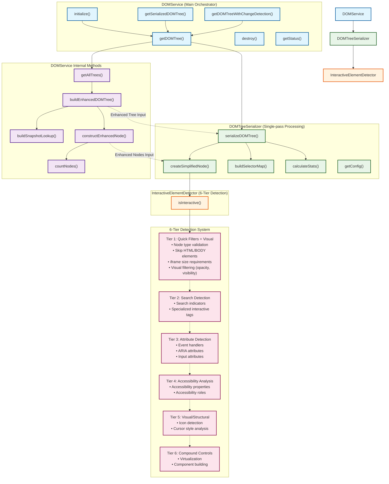

# DOM Service Architecture Workflow

This mermaid chart illustrates the high-level workflow of the DOM Service architecture, showing how the three main classes (DOMService, DOMTreeSerializer, and InteractiveElementDetector) interact. The chart focuses on the main workflow and 6-tier detection system entry points without going into detailed method implementations.

## Summary

This workflow diagram illustrates how the three main classes work together:

1. **DOMService**: The main orchestrator that manages CDP connections, builds enhanced DOM trees, and provides the primary API
2. **DOMTreeSerializer**: Performs single-pass serialization, creating simplified DOM structures optimized for LLM consumption
3. **InteractiveElementDetector**: Implements a comprehensive 6-tier detection system for identifying interactive elements and virtualizing compound controls

The flow shows how CDP commands are used throughout the process, from initial DOM tree extraction to interactive element highlighting and compound control virtualization.